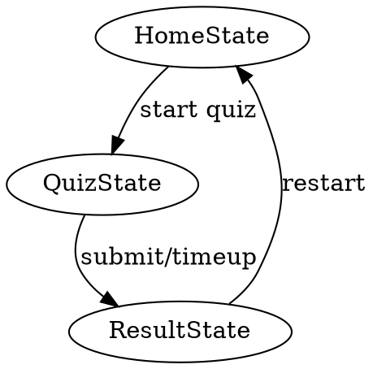

# Quiz Engine Patterns

## Overview

Build quiz functionality using state-based component architecture with server actions for question generation and validation.

## When to Use

- Adding new quiz features
- Modifying quiz state flow
- Debugging quiz timer or pagination
- Adding new question types
- Implementing quiz results/scoring

## Quiz State Flow



## Key Patterns

### Quiz Topics Configuration

```typescript
// data/quiz-topic.tsx
export const quizTopics = [
  { id: 'part1', title: '...' time: 10, amount: 20 },
];
```

### Question State Management

```typescript
// In quiz page component
const [answers, setAnswers] = useState<Record<string, string>>({});
const [currentPage, setCurrentPage] = useState(1);
const [quizCompleted, setQuizCompleted] = useState(false);
```

### Timer Component

```typescript
<QuizTimer
  duration={topic.time * 60}
  onTimeUp={handleTimeUp}
/>
```

### Server Action for Quiz Generation

```typescript
// actions/quiz.ts
'use server'
export async function generateQuiz(topicId: string): Promise<QuizResponse>
```

### Submit and Scoring

```typescript
// POST /api/quiz
const result = await fetch('/api/quiz', {
  method: 'POST',
  body: JSON.stringify({ answers, topicId }),
});
```

## Component Architecture

| Component | Purpose |
|-----------|---------|
| `page.tsx` | Root quiz page, manages state |
| `QuizState.tsx` | Main quiz UI with timer, progress |
| `QuizTimer.tsx` | Countdown timer with callback |
| `QuizQuestont.tsx` | Question display with options |
| `QuizPagination.tsx` | Page navigation |
| `ResultState.tsx` | Results display |

## Common Mistakes

- Forgetting to reset answers on new quiz
- Not handling time expiration properly
- Not validating all questions answered before submit
- Mixing server/client state incorrectly

## Type Definitions

```typescript
interface Question {
  id: string;
  text: string;
  options: { id: string; text: string }[];
  correctAnswer: string;
}

interface QuizResponse {
  questions: Question[];
  topicId: string;
}
```

## Quick Reference

| Task | Location |
|------|----------|
| Add topic | `data/quiz-topic.tsx` |
| Quiz server action | `actions/quiz.ts` |
| Quiz API route | `app/api/quiz/route.ts` |
| Quiz schema | `lib/schemas/quiz.ts` |