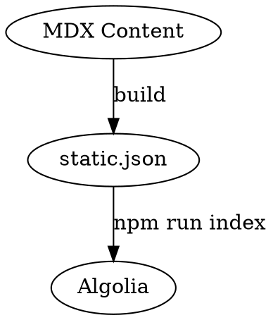

# Search Indexing Patterns

## Overview

Manage search indexing with Algolia for full-text search and Pinecone for vector search. Index updates run via npm script after build.

## When to Use

- Updating search index after content changes
- Debugging search results
- Adding new search features
- Configuring search settings
- Troubleshooting missing content in search

## Indexing Pipeline



## Commands

```bash
npm run index    # Update Algolia index
npm run build    # Build + update index
```

## Key Files

| File | Purpose |
|------|---------|
| `scripts/update-index.mjs` | Index sync script |
| `lib/algolia-client.ts` | Algolia search client |
| `lib/pinecone.ts` | Pinecone vector client |
| `app/api/search/route.ts` | Search API endpoint |

## Algolia Configuration

```javascript
// Index settings in update-index.mjs
{
  queryLanguages: ['en', 'th'],
  searchableAttributes: ['title', 'description', 'content', 'structured.headings'],
  customRanking: ['desc(weight.title)', 'desc(weight.content)'],
}
```

## Environment Variables

```env
NEXT_PUBLIC_ALGOLIA_APP_ID=
NEXT_PUBLIC_ALGOLIA_SEARCH_API_KEY=
ALGOLIA_ADMIN_API_KEY=          # server-side only, no NEXT_PUBLIC_ prefix
PINECONE_API_KEY=
PINECONE_INDEX_NAME=
```

## Common Issues

- **Missing content in search**: Run `npm run index` after adding new docs
- **Stale results**: Clear browser cache or re-run index
- **Missing env vars**: Create `.env.local` with required keys

## Quick Reference

| Task | Command |
|------|---------|
| Update index | `npm run index` |
| Full rebuild | `npm run build` |
| Test search | Visit `/docs` and use search |